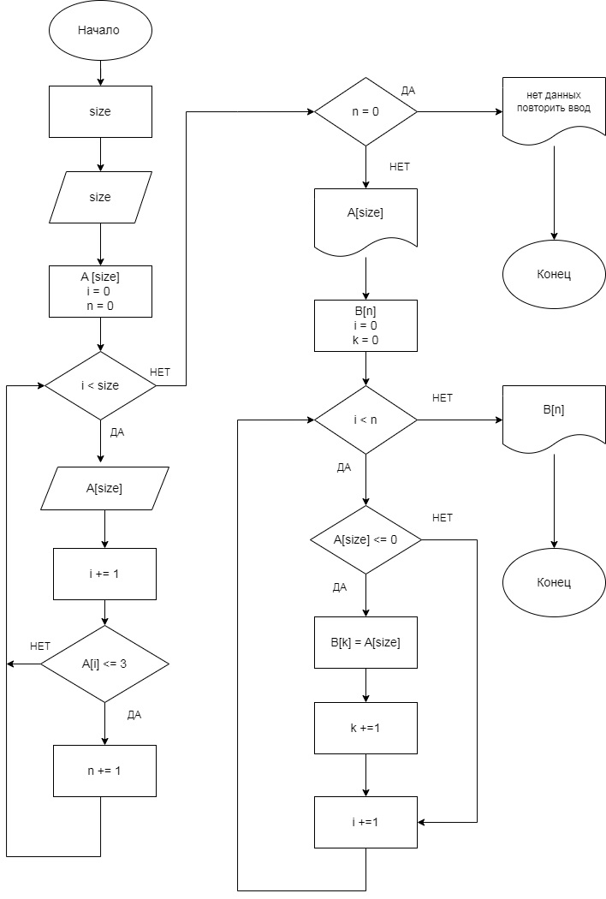

# Итоговая проверочная работа
## Программа реализована линейным, (тривиальным) методом для формирования наглядной блок-схемы.  

## __ЗАДАНИЕ:__
      Написать программу, которая из имеющегося массива строк формирует массив из строк, длина которых меньше либо равна 3 символа. Первоначальный массив можно ввести с клавиатуры, либо задать на старте выполнения алгоритма. При решение не рекомендуется пользоваться коллекциями, лучше обойтись исключительно массивами.

### _Состав задания:_
1. Создать репозиторий на GitHub
2. Нарисовать блок-схему алгоритма (алгоритм реализован для случая линейного программирования).
3. Снабдить репозиторий оформленным текстовым описанием решения (файл README.md)
4. Написать программу, решающую поставленную задачу
5. Использовать контроль версий в работе над этим небольшим проектом (не должно быть так, что все залито одним коммитом, как минимум этапы 2, 3 и 4 должны быть расположены в разных коммитах)  

## __Этап 1.__ Создать репозиторий на GitHub.
Ссылка на репозиторий https://github.com/paveld4n/FinalTask.git

## __Этап 2.__ Блок схема алгорима.

- В папке находится файл с изображением блок-схемы.   

## __Этап 3.__ Описание алгоритма решения задачи
- Пользователь указывает размерность массива (N) который он хочет задать.
- Далее пользователь заполняет стартовый массив элементами в цикле N-раз. В процессе проверяем, соответствует ли вводимый элемент условию "длина элемента массива <= 3". Если элемент подходит под данное условие и если "ДА", то мы использем счетчик "N", увеличивая значения при каждом соотвествии. 
- Проводим проверку на наличие элементов первичного массива соответствующим требованиям задачи и если они есть, то на печать выводится первичный масссив и программа выполняется далее. Если нет, то программа прерывается и выводится текстовая строка "Строк нужной размерности не найдено. Повторите процедуру!".  
- Далее создаем итоговый массив размера "N". Проходим по начальному массиву и найдя элемент удовлетворяющим требованимя и заполняем итоговый массив.
Итоговый массив выводится на печать.

## __Этап 4.__ Решение задачи на C#
В папке решение задачи на C# с использованием линейного (тривиального метода). 
Этот вариант решения реализован для формирования наглядной блок-схемы.

